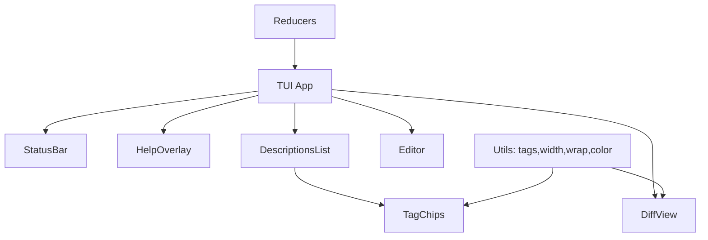

# Design Document

## Overview

This design implements a set of TUI UX enhancements for mcp-launch: truthful multi-tag description status chips, grouped multi-line key help with a shared status bar, robust diff viewer (unified and side-by-side) with working wrap and horizontal scrolling, clear editor modes (INSERT/CMD) with wrap persistence, consistent list behaviors, NO_COLOR fallbacks, and deterministic narrow-width fallback. The solution emphasizes reducers for state, View* helpers for rendering, and modular widgets.

## Steering Document Alignment

### Technical Standards (tech.md)
- Diff view supports unified and side-by-side with intraline highlights and clean color scheme; provide ASCII fallbacks for NO_COLOR.
- Maintain terminal responsiveness under large tool lists; avoid UI/proc coupling.
- Use Bubble Tea/Lipgloss for TUI; no CGO and minimal dependencies.

### Project Structure (structure.md)
- Implementation lives under `internal/tui/` with SRP per file.
- Reducers encapsulate state transitions; View helpers render without side effects.
- Widgets are modular and reusable: status bar, help overlay, tag chips, diff, editor.

## Code Reuse Analysis

### Existing Components to Leverage
- TUI app shell and navigation patterns (arrow/enter/space) for consistent behavior.
- Any existing diff/highlight utilities (if present) for color/intraline rendering; else add focused helpers.
- Existing list models for Allowed/Disallowed tools and Descriptions list.

### Integration Points
- Descriptions: compute tags from raw and modified text; integrate into list items and multi-select view.
- Diff: RAW vs OVERRIDE source from tool server definitions; fall back gracefully on missing input.
- Editor: integrate with existing edit buffers and save flow; recompute tags post-save.

## Architecture

- State-first architecture using Bubble Tea model + reducers. Rendering split into View helpers. Widgets encapsulate styling/interaction and are composed in feature views.
- Deterministic narrow fallback: when terminal width < `2×minCol + sep + gutters`, switch to unified view with notice; on resize back above threshold, restore side-by-side view.

### Modular Design Principles
- Single File Responsibility: each widget/util in its own file.
- Component Isolation: small, focused components (status bar, help overlay, tag chips, diff, editor).
- Service Separation: UI only (no process orchestration).
- Utility Modularity: reusable functions for tags computation, width math, wrap and scroll indicators.

## Components and Interfaces

### StatusBar (internal/tui/widgets/statusbar)
- Purpose: Display current mode (INSERT/CMD), wrap state, view mode (unified/side-by-side), width, and scroll position indicator.
- Interfaces:
  - `func NewStatusBar() StatusBar`
  - `func (s StatusBar) View(state UIState) string`
- Dependencies: UIState; color/NO_COLOR helpers.
- Reuses: width and scroll indicator utilities.

### HelpOverlay (internal/tui/widgets/helpoverlay)
- Purpose: Multi-line, grouped keys legend with current mode indicated.
- Interfaces:
  - `func NewHelpOverlay() HelpOverlay`
  - `func (h HelpOverlay) View(state UIState) string`
- Dependencies: UIState (to show mode and toggles).

### TagChips (internal/tui/widgets/tagchips)
- Purpose: Render color-coded/ASCII status chips in a stable order.
- Interfaces:
  - `type Tag struct { Kind TagKind; Value int }
    type TagKind int // EDITED, TRIMMED, TRUNCATED, OVER_LIMIT, ORIG_LEN, MOD_LEN
    func ComputeTags(raw, modified string, limit int, edited bool) []Tag
    func (t Tag) String(noColor bool) string`
- Dependencies: util/tags (ComputeTags); util/color.
- Reuses: limit from state; edited flag metadata.

### DiffView (internal/tui/widgets/diff)
- Purpose: Unified and side-by-side views with sticky headers, stable vertical separator, intraline highlighting, and working wrap toggle.
- Interfaces:
  - `type DiffMode int // Unified, SideBySide`
  - `func NewDiffView() DiffView`
  - `func (d DiffView) View(state UIState, raw, override string) string`
  - Horizontal scrolling events: `ScrollLeft/Right(fast bool)`; toggle wrap; toggle sync scroll.
- Dependencies: util/width (layout math); util/wrap; util/color; optional diff/intraline helper.

### Editor (internal/tui/widgets/editor)
- Purpose: Clear CMD/INSERT modes, wrap persistence across modes, cursor/viewport guarantees, counters on save.
- Interfaces:
  - `type EditorMode int // CMD, INSERT`
  - `func NewEditor() Editor`
  - `func (e Editor) View(state UIState, buf string) string`
  - Mode switch event; wrap toggle; save to propagate edited flag and recompute tags.
- Dependencies: reducers, util/wrap.

## Data Models

### UIState (internal/tui/state/models.go)
- `Mode EditorMode` (CMD|INSERT)
- `Wrap bool`
- `View DiffMode` (Unified|SideBySide)
- `Width int`
- `MinCol int` (min readable column width; default sensible value)
- `ScrollHLeft, ScrollHRight int` (per-column horizontal scroll)
- `ScrollV int`
- `SyncScroll bool` (column scroll sync)
- `Limit int` (default 300)
- `Edited bool` (user-initiated changes flag)
- `Notice string` (resize/fallback toast)

### Tag Model (internal/tui/state/tags.go)
- `type TagKind int` (EDITED, TRIMMED, TRUNCATED, OVER_LIMIT, ORIG_LEN, MOD_LEN)
- `type Tag struct { Kind TagKind; Value int }`

## Error Handling

### Error Scenarios
1. Missing RAW/OVERRIDE: Show empty-side notice with guidance; avoid crashes.
   - Handling: render placeholder; disable intraline on missing side.
   - User Impact: Notice banner; still navigable.
2. Extremely long lines: Virtualize/chunk render; display scroll indicator.
   - Handling: wrap or truncate view-only with indicator; do not lose data.
   - User Impact: Smooth scrolling; performance preserved.

## Testing Strategy

### Unit Testing
- tags: Edited detection (including whitespace toggle), Trimmed vs Truncated exclusivity, Over Limit math, length counters.
- reducers: ToggleWrap, ToggleMode, Resize (fallback transitions), ToggleView, ScrollH, ToggleSyncScroll; persistence across modes.

### Integration Testing
- DiffView rendering: sticky headers, vertical separator alignment, wrap on/off, NO_COLOR fallbacks.
- Editor: mode toggle toast, viewport maintenance after wrap toggles.

### End-to-End Testing
- Narrow-width fallback transition unified<->side-by-side; help overlay visibility; multi-select with tags.

