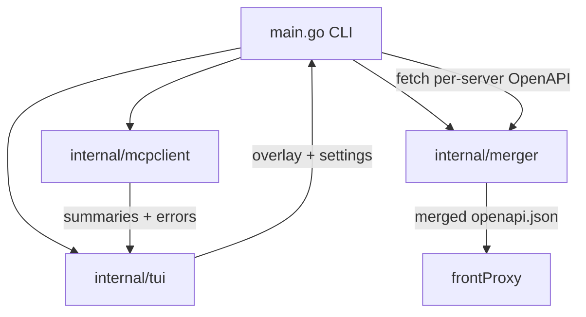

# Design Document

## Overview
This design elevates the mcp-launch preflight TUI and launch mechanics to be reliable, consistent, and modern. It introduces:
- A robust inspector with pagination for `tools/list` and clearer ERR handling.
- A consistent keyboard model (↑/↓ + Enter, Space, `?` help) across all screens.
- A pre-phase Config Collector (path completion, validation, and settings) so users need not pass multiple `--config` flags.
- Powerful description management (trim, truncate, multi-select bulk ops, editor) plus a true diff viewer (unified/side-by-side, char-level, wrap toggle, default wrap on).
- Correct launch mode mapping: Local (none), Cloudflare Quick, Cloudflare Named.
- A dedicated Final Results view that summarizes outcomes with optional logs.
- An improved OpenAPI merge that preserves tool-name accuracy using a three-tier heuristic.

## Steering Document Alignment
### Technical Standards (tech.md)
- SRP packages: changes stay within `internal/mcpclient`, `internal/tui`, `internal/merger`, and `main.go` wiring.
- No CGO, minimal deps. Existing Bubble Tea/Lipgloss remain the TUI foundation.
- Inspector must drain stderr and implement pagination. Tunnel modes mapped plainly.

### Project Structure (structure.md)
- Preserve package boundaries (UI returns overlay only, inspector is protocol-only, merger is pure transforms).
- File sizes: split TUI view/render helpers to keep Update reducer small; isolate DiffWidget.

## Code Reuse Analysis
### Existing Components to Leverage
- `internal/mcpclient`: Extend `InspectServer` to implement pagination over `tools/list` (nextCursor loop) and standardize params `{cursor:null}`. Keep stderr draining goroutine.
- `internal/tui/tui.go`: Reuse view rendering styles; add new screens (Config Collector, Results) and a new DiffWidget and multi-select flow in Descriptions.
- `internal/merger`: Keep ref namespacing; add tool-name heuristic; keep tighten/coerce passes.
- `main.go`: Reuse the orchestration and logging; add a gate for Config Collector; fix launch mode mapping.

### Integration Points
- TUI ← inspector summaries and errors feed list/menu views.
- TUI → overlay persists; `main.go` translates composite overlay to nested overlay (already implemented) and launches stacks.
- Merger ← overlay description overrides; produces merged OpenAPI back to front proxy.

## Architecture
The TUI remains a state machine over an immutable-ish model. New screens and widgets are added; all inputs are key events processed in `Update`. The inspector is synchronous per server with timeouts; preflight aggregates into composite server keys. The merger runs post-launch and honors overlay filters and overrides.

### Modular Design Principles
- `mcpclient`: no UI concerns; expose `InspectServer(ctx, name, s)` that returns a full tool list or error with messages. Paginate internally.
- `tui`: no process launch; only returns `overlay` and user choices (`tunnelMode`, verbosity, etc.).
- `merger`: remains transport-agnostic; only operates on fetched JSON specs.

## Components and Interfaces

### A. Inspector (internal/mcpclient)
- Purpose: Return a `Summary{ServerName, Tools[], Err}` per server reliably.
- Interface: `InspectServer(ctx, name, cfg.MCPServer) (Summary, error)`
- Key changes:
  - Send `initialize` → wait for id=1 → send `initialized` → send `tools/list` with `{cursor:null}`.
  - If `result.nextCursor` present, loop with `{cursor: nextCursor}` until exhausted; append tools.
  - Robustly parse `error` payloads and return them; do not crash; still drain stderr.
  - Maintain 6s timeout per phase (init and list).

### B. TUI Core (internal/tui)
- Purpose: Preflight editor returning `Overlay` + `LastLaunch` and session `Settings`.
- New screens:
  1) Config Collector (mode `config`): manage a list of config file paths.
     - Input: a path text box with Tab completion and `~`/env resolution.
     - Suggestions: background directory scan + fuzzy match; Tab accept; Ctrl+Space toggle suggestions list.
     - Settings panel: base ports, verbosity (-v/-vv), tunnel type (`none|quick|named`), and named tunnel value.
     - Actions: Add path, Delete selected, Reorder (↑/↓), Continue.
  2) Results (mode `results`): show per-instance summary with optional logs box (toggle `l`).

- Existing screens refined:
  - List: server rows show badges OK/ERR/HTTP and DISABLED.
  - Menu: actions are selectable items (Enter to choose) rather than numeric-only; numbers remain optional.
  - Allow/Deny: checkbox list with `[x]/[ ]` and Space toggle.
  - Descriptions: badges (RAW n>300, OVR ≤300, OVR); per-tool `e` edit; `+`/`t` trim; `-` clear.
  - Descriptions Multi-select: press `m` to enter multi-select with checkboxes; Space toggles; `Enter` opens an action palette (Trim Selected, Truncate Selected, Clear Overrides Selected).
  - Bulk ops: `X` trim ALL >300; `Shift+X` clear ALL overrides (confirm prompt).
  - Desc Edit: textarea with char count and ≤300 indicator; wrap on; Enter save; Esc cancel.
  - Diff View: DiffWidget (unified/side-by-side, `u`/`s`), char-level highlights, `w` wrap; only mark +/- on changed lines; unchanged faint; identical → “No changes”.
  - Launch: radio-style picker mapped to `none/quick/named`; persists in overlay `LastLaunch`.

- Interfaces remain: `Run(servers, seed, status, errs) (*Overlay, string, error)`; settings persisted via overlay’s `LastLaunch` and (optionally) a small session settings file later.

### C. DiffWidget (internal/tui)
- Implementation: `diffmatchpatch` for line+char spans; rendering helpers for unified/sxs modes; soft wrap default on; color tokens for added/removed and in-line spans.

### D. Merge Heuristic (internal/merger)
- Order: first path segment → `x-mcp-tool`/`x-tool` → `operationId` prefix `<tool>__`; warn and allow on unresolved mapping; keep `<server>__` prefix for operationId; preserve current ref namespacing safety.

### E. Launch Mode Mapping (main.go + TUI)
- TUI maps to `TunnelMode`: `none|quick|named`.
- `main.go`: `none` (no tunnel), `quick` (startQuickTunnel), `named` (startNamedTunnel only; require `--public-url` from user’s DNS).

### F. Final Results View (internal/tui)
- Sections: OpenAPI URL (copyable), masked X-API-Key, MCP server count, Endpoints (with near/over-30 warnings), per-server tool counts and long-desc flags.
- Logs: bounded, scrollable region (bordered) toggled by `l`; hidden by default unless verbose/stream.
- Copy block: `s` prints compact `OPENAPI=`/`API_KEY=` lines.

## Data Models
- Extend TUI model with `sessionSettings` and screen modes `config`, `results`.
- Keep `Overlay` (allow/deny/desc and `LastLaunch`).

## Error Handling
- Inspector invalid params: use `{cursor:null}` then surface error if server rejects; still list server.
- Quick tunnel timeout: proceed local-only with warning.
- TUI cancel/error: abort launch safely.

## Testing Strategy
- Unit: inspector pagination + minimal params; merger mapping; trim/truncate helpers; diff rendering functions (golden snapshots).
- Integration: simulated paginated servers; quick tunnel log parsing.
- E2E: multi-config scenario covering allow/deny, multi-select bulk trim/truncate, named tunnel, results screen.
