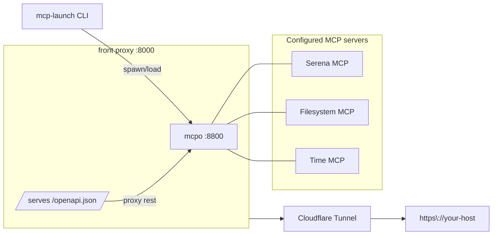

# mcp-launch — one URL for many MCP servers (via **mcpo**)

> **Project scope & credits**  
> `mcp-launch` is a thin **wrapper** around existing, excellent projects:
>
> - **[`mcpo`](https://github.com/open-webui/mcpo)** — turns MCP servers into HTTP/OpenAPI with per‑tool routes and docs.
> - **MCP servers** such as **[`Serena`](https://github.com/oraios/serena)**.
> - **Cloudflare Tunnel** — to expose a stable public HTTPS URL without port‑forwarding.
>
> This tool simply **supervises processes**, **merges per‑tool OpenAPI specs** into a single `/openapi.json`, and prints the **one URL** to paste into a Custom GPT.  
> It does **not** reimplement MCP or `mcpo`, and it aims to stay minimal and maintainable.
>
> _Not affiliated with or endorsed by OraiOS/Serena, Open WebUI/mcpo, Cloudflare, or OpenAI. All trademarks belong to their respective owners._

`mcp-launch` is a **small wrapper** that:

- Starts **mcpo** as a single front door for one or more **MCP** servers
- Optionally publishes it via **Cloudflare Tunnel**
- Generates a **single merged OpenAPI** spec that you can import into a **Custom GPT** as Actions
- Exposes `/openapi.json` on the same public URL as your API routes

**No wheel‑reinventing.** `mcpo` already supports multi‑server configs and per‑tool OpenAPI + docs; we just supervise it, merge the specs, and publish the result.

---

## Table of contents

- [mcp-launch — one URL for many MCP servers (via **mcpo**)](#mcp-launch--one-url-for-many-mcp-servers-via-mcpo)
  - [Table of contents](#table-of-contents)
  - [How it works](#how-it-works)
  - [Prerequisites](#prerequisites)
  - [Install / Build](#install--build)
  - [Quick start (dev)](#quick-start-dev)
  - [Stable setup (prod)](#stable-setup-prod)
  - [Add to a Custom GPT](#add-to-a-custom-gpt)
  - [Command reference](#command-reference)
  - [Configuration reference (`mcp.config.json`)](#configuration-reference-mcpconfigjson)
  - [Security notes](#security-notes)
  - [Troubleshooting](#troubleshooting)
  - [FAQ](#faq)
  - [Credits \& thanks](#credits--thanks)
  - [License](#license)

---

## How it works

```text
How it works

                 spawns/loads (stdio/SSE/HTTP)             HTTP (OpenAPI + tools)
+------------+  --------------------------------------->   +-------------+
| mcp-launch |                                             |  mcpo :8800 |
+------------+                                             +-------------+
      |
      | front proxy :8000
      |   - serves /openapi.json
      |   - proxies everything else to mcpo
      v
+-------------+            public HTTPS
| cloudflared | ---------------------------------------> https://your-host
+-------------+

mcpo connects to MCP servers defined in mcp.config.json:

+-------------+   +--------------+   +-----------+    ...
|  Serena MCP |   |  Filesystem  |   |  Time MCP |
+-------------+   +--------------+   +-----------+
```

---



- `mcpo` exposes each MCP server at `/<name>` with its own docs at `/<name>/docs`.
- The front proxy (default `:8000`) **serves `/openapi.json`** (the merged spec) on the **same** host/port it proxies to `mcpo`.
- With Cloudflare (Quick or Named), you get a public HTTPS URL to share with ChatGPT.

---

## Prerequisites

- **Go 1.22+** (to build this CLI)
- **mcpo** (Python; install with pipx or uv)
- **cloudflared** (for public URL via Cloudflare Tunnel)
- Optional: **uv** (`uvx`) and **node** (`npx`) if your MCP servers use them

Suggested installs:

```bash
# macOS
brew install go cloudflared uv
pipx install mcpo

# Ubuntu/Debian
sudo snap install go --classic || sudo apt-get install -y golang
curl -fsSL https://pkg.cloudflare.com/cloudflared/install.sh | sudo bash
pipx install mcpo
pipx install uv
sudo apt-get install -y nodejs npm
```

---

## Install / Build

```bash
git clone <your fork> mcp-launch && cd mcp-launch
go build -o mcp-launch
```

Windows:

```powershell
go build -o mcp-launch.exe
```

---

## Quick start (dev)

```bash
# 1) Generate a default Claude-style config + state
./mcp-launch init

# 2) Bring everything up using an ephemeral Cloudflare Quick Tunnel
./mcp-launch up --tunnel quick

# 3) Copy the printed URL ending in /openapi.json
#    (e.g., https://random.trycloudflare.com/openapi.json)
```

You can explore per‑tool docs in your browser:

```bash
https://<public>/serena/docs
https://<public>/time/docs
...
```

Stop:

```bash
./mcp-launch down
```

---

## Stable setup (prod)

Use a **Named Tunnel** for a stable domain you own.

1. Create a tunnel + DNS in Cloudflare Zero Trust (map `gpt-tools.example.com`).
2. Run:

```bash
./mcp-launch up --tunnel named \
  --public-url https://gpt-tools.example.com \
  --tunnel-name <YOUR_TUNNEL_NAME>
```

You’ll paste **`https://gpt-tools.example.com/openapi.json`** into ChatGPT once this is up.

> Note: Because the front proxy serves **both** `/openapi.json` and all tool routes on the same port, you don’t need special path ingress. Point the named tunnel host at your front proxy; that’s it.

---

## Add to a Custom GPT

1. Open ChatGPT → **Create a GPT** → **Configure** → **Actions**.
2. Choose **Import from URL** and paste the printed schema URL, e.g.:

   ```bash
   https://gpt-tools.example.com/openapi.json
   ```

3. Set **Authentication** to **API Key**, header **`X-API-Key`**.
4. Paste the same key that `mcp-launch up` printed.

That’s all—your GPT now sees *all* your MCP tools through one Action.

---

## Command reference

Run `mcp-launch help` for a summary, or `mcp-launch help up` for subcommand help.

**`init`**
Scaffold `mcp.config.json` and default state at `./.mcp-launch/state.json`.

**`up`**
Start mcpo (default `:8800`), start the front proxy (default `:8000`) that serves `/openapi.json` and proxies everything else, optionally run Cloudflare Tunnel, and generate the merged OpenAPI.

Options:

```bash
--config PATH        Path to Claude-style config (default: mcp.config.json)
--port N             Front proxy port (default: 8000)
--mcpo-port N        mcpo port (default: 8800)
--api-key KEY        API key for mcpo (generated if omitted)
--tunnel MODE        quick | named | none (default: quick)
--public-url URL     Public base URL used inside the merged OpenAPI (recommended for named/none)
--tunnel-name NAME   Named tunnel to run (for --tunnel named)
```

**`status`**
Show ports, public URL (if any), detected tool names, and your API key header.

**`openapi`**
Regenerate the merged OpenAPI (useful after editing your config).
Options:

```bash
--public-url URL     Override the base URL used in the spec’s servers[0].url
```

**`share`**
Print the single URL ending in `/openapi.json` for easy copy/paste.

**`down`**
Stop `cloudflared` and `mcpo` processes that were started by this tool.

**`doctor`**
Check for required binaries (`mcpo`, `cloudflared`), plus `uvx` and `npx` if your config references them.

**`version`**
Print the CLI version.

---

## Configuration reference (`mcp.config.json`)

This file is **Claude/Desktop‑style** and read by **mcpo** directly. `mcp-launch` just points `mcpo` at it.

```json
{
  "mcpServers": {
    "serena": {
      "command": "uvx",
      "args": [
        "--from", "git+https://github.com/oraios/serena",
        "serena", "start-mcp-server",
        "--context", "ide-assistant"
      ]
    },
    "filesystem": {
      "command": "npx",
      "args": ["-y", "@modelcontextprotocol/server-filesystem", "."]
    },
    "time": {
      "command": "uvx",
      "args": ["mcp-server-time", "--local-timezone=America/Phoenix"]
    }
  }
}
```

- Each server is exposed by mcpo at `/<name>` with docs at `/<name>/docs`.
- If you prefer **SSE/HTTP** for a server you run yourself, mcpo also supports config entries with `type: "sse"` or `"streamable-http"` and a `url`. You can place such entries here, and mcpo will connect.

---

## Security notes

- **API key**: `mcp-launch` uses a cryptographically random key when you don’t pass `--api-key`. All requests must include `X-API-Key: <value>`. Rotate anytime by re‑running `up` with a new key and updating your GPT Action.
- **Surface area**: The front proxy serves only `/openapi.json` and proxies the rest to mcpo. mcpo exposes only the tools you’ve configured.
- **Tunnels**: Quick Tunnels are convenient but **ephemeral**; use Named Tunnels for stable URLs.

---

## Troubleshooting

- **Binary not found**
  `doctor` will tell you if `mcpo`, `cloudflared`, `uvx`, or `npx` can’t be found in `PATH`.

- **No public URL printed** (Quick Tunnel)
  Sometimes `cloudflared` logs are slow to emit the `.trycloudflare.com` URL. Re‑run `up --tunnel quick`. If it persists, prefer a Named Tunnel.

- **Spec import fails in ChatGPT**
  Ensure the schema URL ends with `/openapi.json` and that the spec’s `servers[0].url` is your **public** base. Re‑run:

  ```bash
  mcp-launch openapi --public-url https://your-host
  ```

- **Port in use**
  The CLI auto‑picks the next available port near your chosen `--port`/`--mcpo-port`. Check `status` for the actual values.

---

## FAQ

**Q: Why not point ChatGPT to multiple Actions—one per server?**
A: You can, but one merged Action keeps your GPT simpler and mirrors how IDEs bundle multiple MCP tools.

**Q: Do I need special Cloudflare path rules?**
A: No. The front proxy serves `/openapi.json` and proxies the rest on the same port/host. Just map your host to the front proxy.

**Q: Where is state stored?**
A: `./.mcp-launch/state.json` (ports, API key, public URL, PIDs).

---

## Credits & thanks

- **[`mcpo`](https://github.com/open-webui/mcpo)** by the Open WebUI community for the MCP→OpenAPI gateway, multi‑server config, hot‑reload, and per‑tool docs.
- **[`Serena`](https://github.com/oraios/serena)** (and the broader MCP ecosystem) for robust servers and great examples.
- **Cloudflare Tunnel** for simple, reliable public URLs to local services.
- **Custom GPT Actions** for making OpenAPI‑described tools easy to wire into ChatGPT.

If you encounter issues that are clearly upstream (e.g., a server’s schema or behavior), please consider filing them with the respective project to benefit everyone. This wrapper intentionally **avoids reinventing wheels**; when upstream adds new capabilities (e.g., unified specs), we’ll remove code rather than duplicate it.

---

## License

MIT
